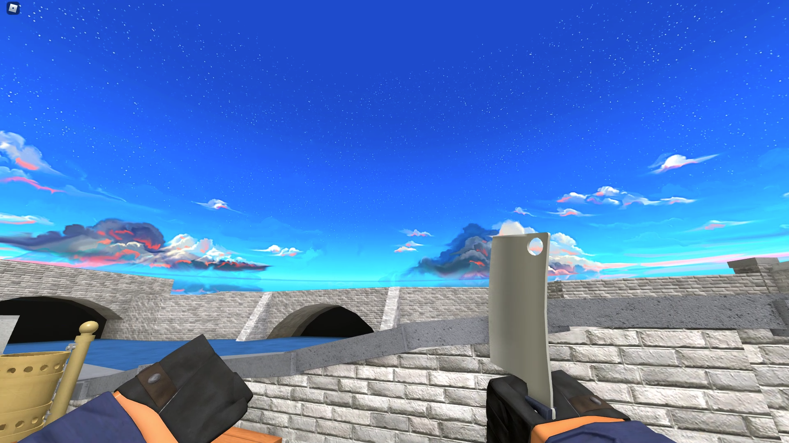
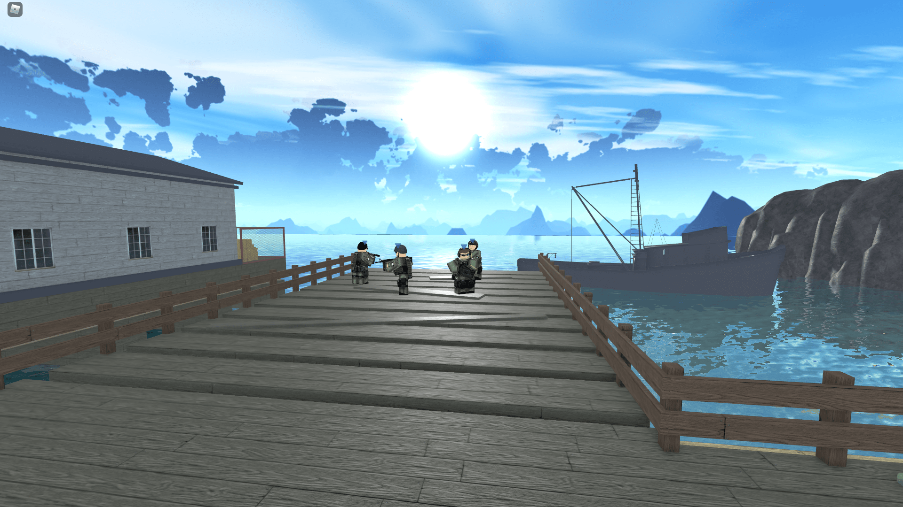
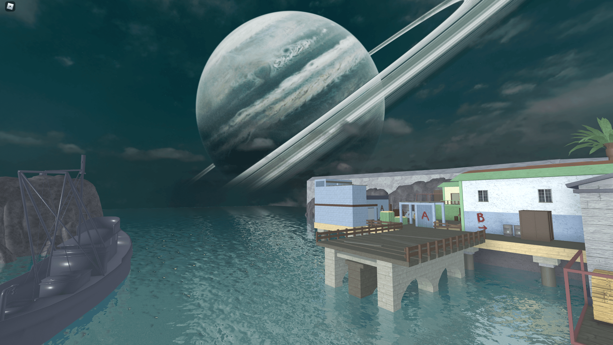
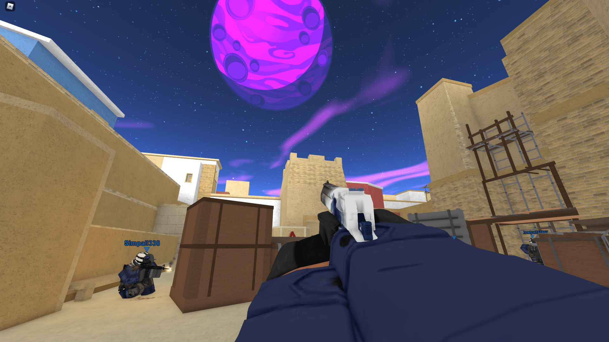
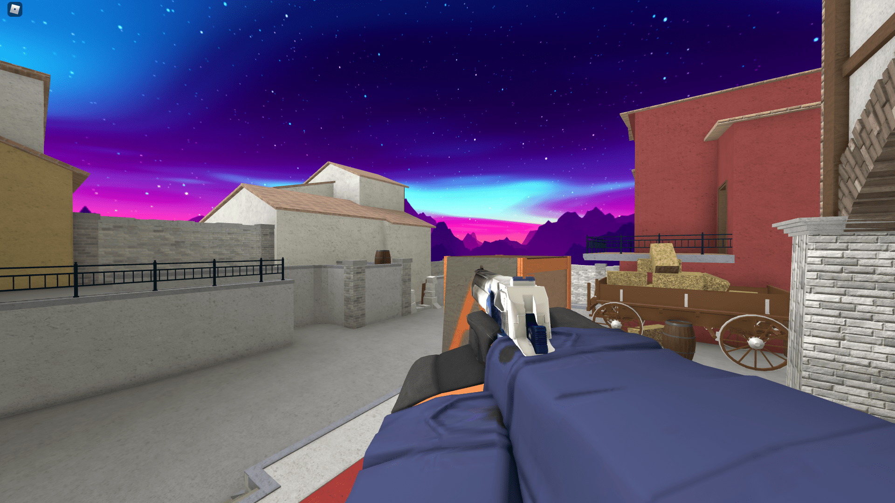
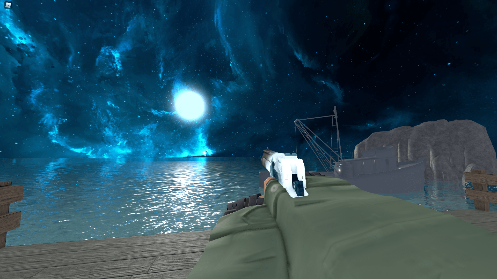
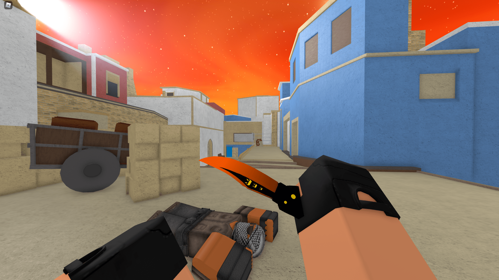
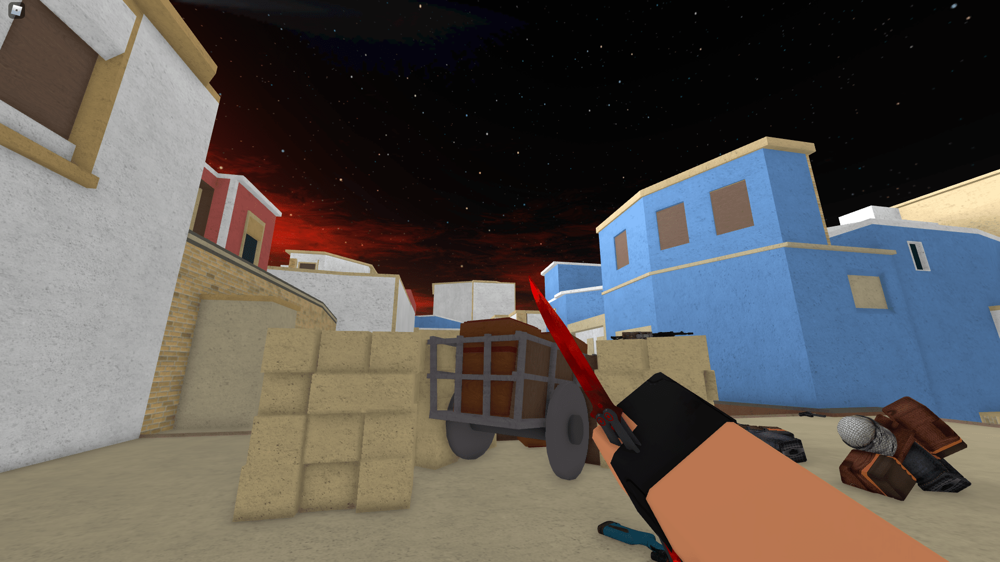
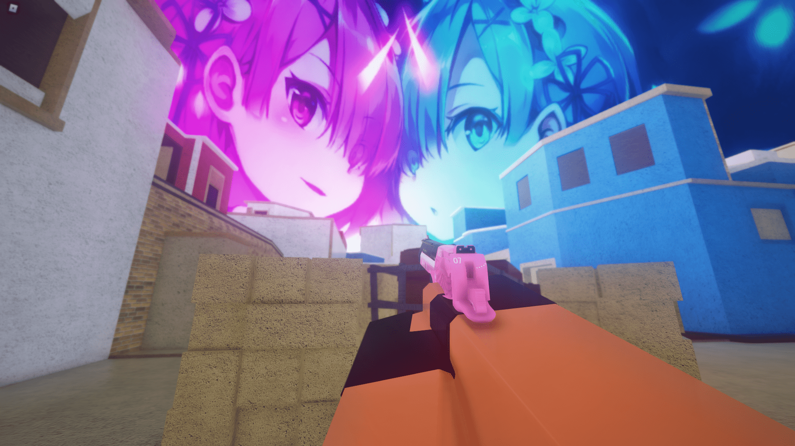
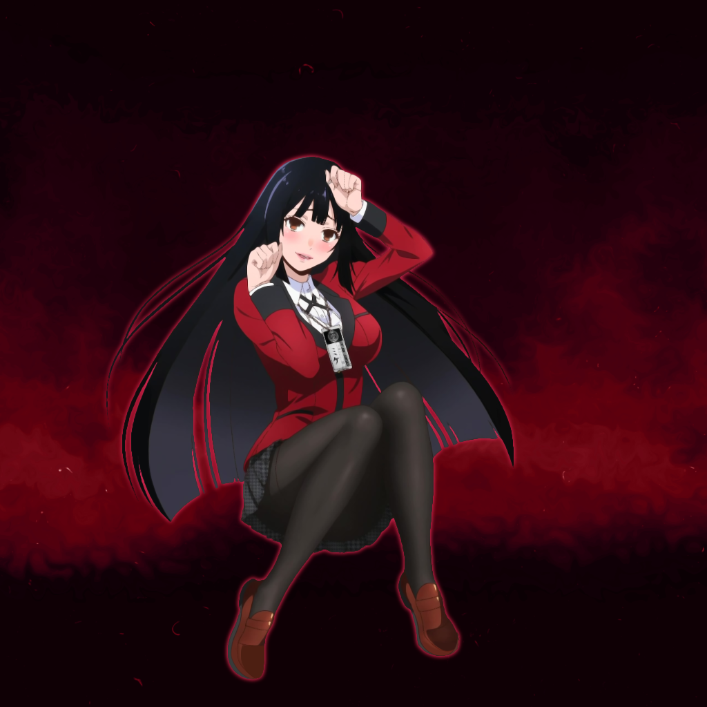

# Roblox Sky Templates

Este repositório contém vários templates de céu para Roblox. Cada pasta representa um template diferente e contém as imagens correspondentes.

## Templates disponíveis

- **Beautfil**
  
  

- **Blue**
  
  

- **Chill gray**
  
  

- **Chill pink**
  
  

- **Cyan**
  
  

- **Light Blue**
  
  

- **Light pink**
  
  

- **NeonSky**
  
  

- **NeonSky2**
  
  

- **Night**
  
  

- **Orange**
  
  

- **Red**
  
  

- **RemRam**
  
  

- **Violet Evergarden**
  
  

- **Yumeko**
  
  
